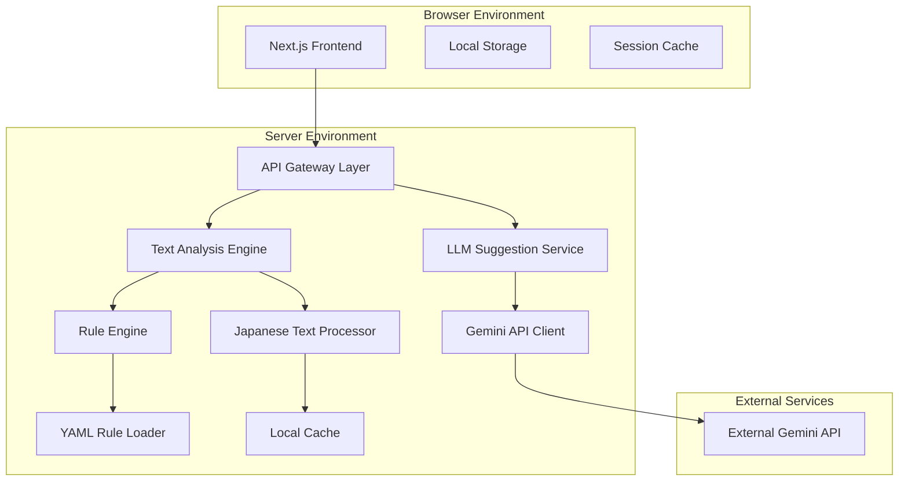
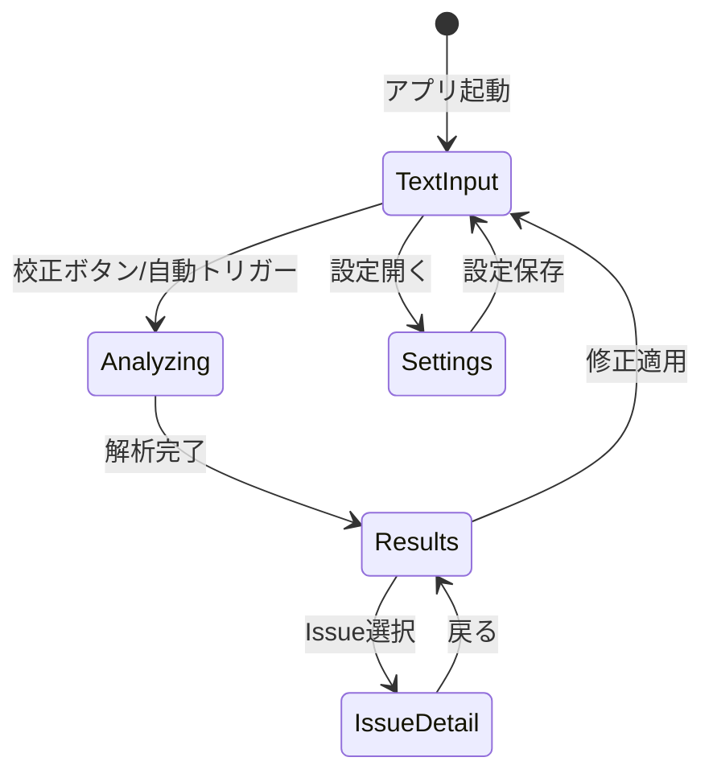
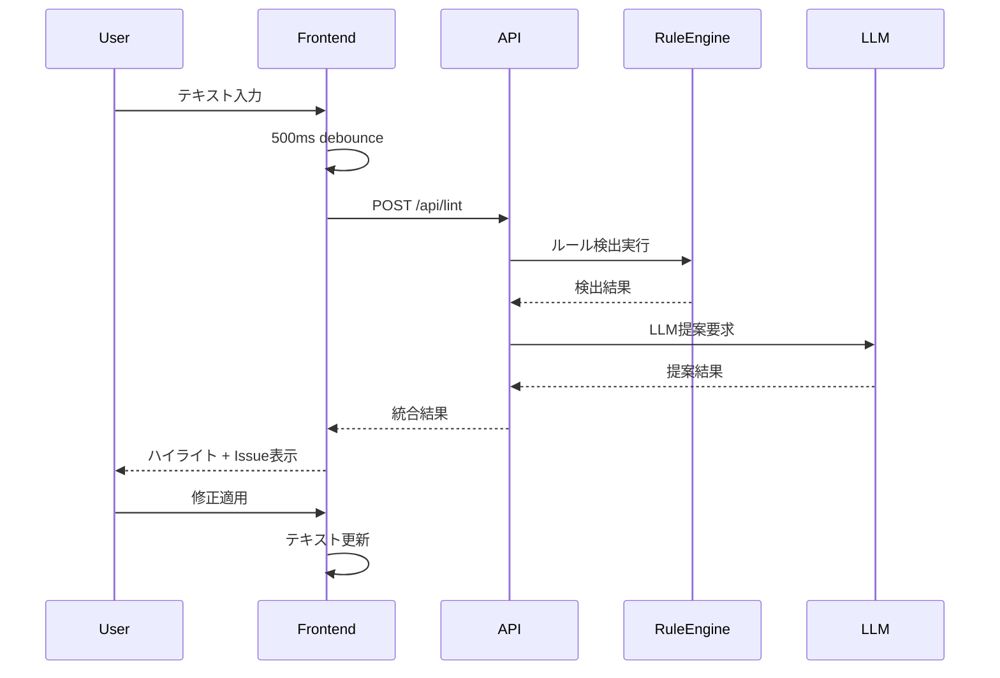
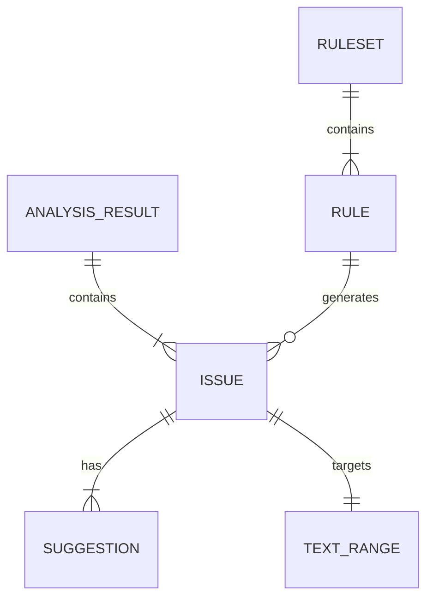

# 技術設計書

## 概要
Bunken（文献）は、Next.js 14とTypeScriptを使用して構築される日本語文章校正Webアプリケーションです。ルールベースエンジンとGemini 2.5 Flash LLMのハイブリッドアプローチで、リアルタイム文章解析と修正提案を提供します。完全ローカル動作でプライバシーを保護し、2000字を5秒以内で処理する高性能設計を実現します。

## 要件マッピング

### 設計コンポーネントトレーサビリティ
各設計コンポーネントは特定の要件に対応します：
- **TextAnalysisEngine** → 要件1: テキスト入力・解析機能
- **RuleBasedDetector** → 要件2: ルールベース検出機能  
- **LLMSuggestionService** → 要件3: LLM提案機能
- **ResultDisplaySystem** → 要件4: 結果表示・修正適用機能
- **RuleManagementSystem** → 要件5: ルール管理機能
- **SecurityLayer** → 要件6: 設定・セキュリティ機能

### ユーザーストーリーカバレッジ
すべてのユーザーストーリーを技術的にアドレス：
- テキスト解析: リアルタイム処理エンジンと自動/手動トリガー
- ルール検出: YAML設定駆動の拡張可能な検出エンジン
- LLM提案: セキュアな抜粋送信とキャッシュ機構
- 結果表示: インタラクティブなハイライトとパネルUI
- ルール管理: ホットリロード対応の設定システム
- セキュリティ: ローカル完結処理とAPIキー保護

## アーキテクチャ



### テクノロジースタック
調査結果に基づく最適化されたスタック選択：

- **Frontend**: Next.js 14 App Router + TypeScript + Tailwind CSS
- **UI Components**: Radix UI + Headless UI（アクセシビリティ対応）
- **状態管理**: Zustand + React Query（軽量・高性能）
- **API**: Next.js API Routes（統合開発環境）
- **日本語処理**: Custom regex + Unicode normalization
- **LLM統合**: Gemini 2.5 Flash（ローカルHTTP API）
- **テスト**: Vitest + Testing Library + Playwright
- **開発**: ESLint + Prettier + Husky

### アーキテクチャ決定根拠
調査に基づく技術選択の理由：

- **Next.js 14**: App Routerのサーバーコンポーネントで初期表示高速化、API Routesで統合開発
- **TypeScript**: 日本語テキスト処理の複雑な型定義と実行時エラー防止
- **Tailwind CSS**: Dialin AI風デザインシステムの効率的実装
- **Zustand**: Reduxより軽量、複雑な校正状態管理に適している
- **Gemini 2.5 Flash**: 高速応答（1.5-3秒）と日本語理解の優秀性

### 画面遷移


### データフロー
主要なデータフロー：テキスト入力 → 解析処理 → 結果表示 → 修正適用

#### 主要ユーザーフロー
テキスト校正プロセスのシーケンス図：



## コンポーネント・インターフェース

### バックエンドサービス・メソッドシグネチャ

```typescript
class TextAnalysisService {
  async analyzeText(
    text: string, 
    options: AnalysisOptions
  ): Promise<AnalysisResult>  // メイン解析エンドポイント
  
  async getLLMSuggestions(
    passages: TextPassage[], 
    style: WritingStyle
  ): Promise<LLMSuggestion[]>  // LLM提案生成
}

class RuleEngine {
  loadRuleset(rulesetId: string): Promise<Ruleset>  // ルール読み込み
  detectIssues(text: string): DetectionResult[]     // 問題検出
  getSafeReplacements(): SafeReplacement[]          // 安全置換取得
}

class CacheService {
  getCachedResult(textHash: string): AnalysisResult | null  // キャッシュ取得
  setCachedResult(textHash: string, result: AnalysisResult): void  // キャッシュ保存
}
```

### フロントエンドコンポーネント

| コンポーネント名 | 責任 | Props/State概要 |
|-----------------|------|-----------------|
| TextEditor | メインテキスト入力 | text, onChange, isAnalyzing |
| TextHighlight | ハイライト表示 | issues, selectedIssue, onIssueSelect |
| IssueList | Issue一覧表示 | issues, filter, onIssueSelect |
| IssueDetail | Issue詳細パネル | selectedIssue, onApply, onDismiss |
| ProofreadingActions | 校正アクション | onAnalyze, onFixAll, isLoading |
| SettingsModal | 設定モーダル | isOpen, settings, onSave |
| RulesetSelector | ルールセット選択 | rulesets, selected, onChange |

### APIエンドポイント

| Method | Route | Purpose | Auth | Status Codes |
|--------|-------|---------|------|--------------|
| POST   | /api/lint | テキスト解析実行 | None | 200, 400, 429, 500 |
| POST   | /api/suggest | LLM提案取得 | None | 200, 400, 408, 429, 500 |
| GET    | /api/rulesets | ルールセット一覧 | None | 200, 500 |
| GET    | /api/rulesets/:id | 特定ルールセット取得 | None | 200, 404, 500 |

## データモデル

### ドメインエンティティ
1. **AnalysisResult**: 解析結果（Issues + メタ情報）
2. **Issue**: 検出された問題（ルール/LLM由来）
3. **Suggestion**: 修正提案（テキスト + 理由）
4. **Ruleset**: ルールセット設定
5. **TextRange**: テキスト範囲（start, end位置）

### エンティティ関係


### データモデル定義

```typescript
interface AnalysisResult {
  issues: Issue[];
  meta: {
    elapsedMs: number;
    textLength: number;
    rulesetVersion: string;
  };
}

interface Issue {
  id: string;
  source: 'rule' | 'llm';
  severity: 'info' | 'warn' | 'error';
  category: 'style' | 'grammar' | 'honorific' | 'consistency' | 'risk';
  message: string;
  range: TextRange;
  suggestions: Suggestion[];
  ruleId?: string;
}

interface Suggestion {
  text: string;
  rationale?: string;
  isSafeReplacement: boolean;
}

interface TextRange {
  start: number;
  end: number;
}

interface Ruleset {
  id: string;
  version: string;
  name: string;
  rules: Rule[];
}

interface Rule {
  id: string;
  category: string;
  severity: 'info' | 'warn' | 'error';
  pattern: string | RegExp;
  message: string;
  suggestions?: string[];
  enabled: boolean;
}
```

## エラーハンドリング

### エラー戦略
- **入力検証**: 文字数制限・不正文字のクライアント側チェック
- **解析エラー**: ルールエンジンエラーでも部分結果を返す
- **LLMタイムアウト**: 10秒タイムアウトでルール結果のみ表示
- **ネットワークエラー**: リトライ機能と優雅な劣化
- **設定エラー**: フォールバック設定で継続運用

```typescript
class ErrorHandler {
  handleAnalysisError(error: Error): PartialAnalysisResult {
    // ルール結果は保持、LLMのみエラー
  }
  
  handleRulesetLoadError(error: Error): Ruleset {
    // デフォルトルールセットにフォールバック
  }
}
```

## セキュリティ考慮事項

### プライバシー保護
- **ローカル処理**: 文章データはブラウザメモリ上のみ
- **抜粋送信**: LLM送信は対象文±前後1文のみ
- **APIキー保護**: 環境変数管理、フロントエンド非公開
- **データ永続化なし**: リフレッシュで完全消去

### セキュリティ実装
```typescript
class SecurityService {
  sanitizeInput(text: string): string {
    // XSS防止、不正文字除去
  }
  
  extractMinimalContext(text: string, range: TextRange): string {
    // 最小限の文脈抽出（前後1文）
  }
  
  validateAPIKey(): boolean {
    // APIキー形式検証
  }
}
```

## パフォーマンス・スケーラビリティ

### パフォーマンス目標
| 指標 | 目標値 | 測定方法 |
|------|--------|----------|
| 2000字解析応答時間 (P95) | < 5秒 | API レスポンス測定 |
| ルール再実行 (P99) | < 1秒 | キャッシュヒット測定 |
| LLM提案応答時間 | 1.5-3.0秒 | 外部API測定 |
| 初回ペイント | < 1.5秒 | Core Web Vitals |
| 修正提案採用率 | ≥ 60% | ユーザーアクション追跡 |

### キャッシュ戦略
- **ブラウザキャッシュ**: ルールセットファイル（1時間）
- **メモリキャッシュ**: 解析結果（テキストハッシュベース）
- **LLMキャッシュ**: 同一抜粋の再送抑制（セッション内）
- **ルールキャッシュ**: コンパイル済み正規表現（アプリ起動時）

### 最適化アプローチ
```typescript
class PerformanceOptimizer {
  debounceInput(callback: Function, delay: number = 500): Function {
    // 入力デバウンス実装
  }
  
  cacheAnalysisResult(textHash: string, result: AnalysisResult): void {
    // 解析結果キャッシュ
  }
  
  useWebWorker(heavyTask: Function): Promise<any> {
    // 重い処理をWeb Workerで実行
  }
}
```

## テスト戦略

### リスクマトリクス
| 領域 | リスク | 必須 | オプション | 参照 |
|------|------|------|------------|------|
| 日本語処理 | H | Unit, Integration | 性能テスト | 要件1,2 |
| LLM統合 | M | Contract, Integration | 障害テスト | 要件3 |
| リアルタイム解析 | H | Unit, E2E | 負荷テスト | 要件1 |
| ルール管理 | M | Unit, Integration | UI テスト | 要件5 |
| セキュリティ | H | Security, Unit | 侵入テスト | 要件6 |

### レイヤー別最小要件
- **Unit**: 日本語正規表現、ルールエンジン、テキスト処理
- **Contract**: /lint, /suggest APIエンドポイント
- **Integration**: Gemini API統合、ルール読み込み
- **E2E**: メイン校正フロー、修正適用、設定変更

### CI Gates
| ステージ | 実行 | ゲート | SLA |
|----------|------|--------|-----|
| PR | Unit + Contract | 失敗=ブロック | ≤3分 |
| Deploy | Integration + E2E | 失敗=ブロック | ≤10分 |
| 夜間 | Performance | 劣化→Issue作成 | - |

### 終了条件
- Sev1/Sev2バグ = 0
- 全ゲートパス
- パフォーマンス目標達成（例外は承認記録要）
- アクセシビリティ監査完了